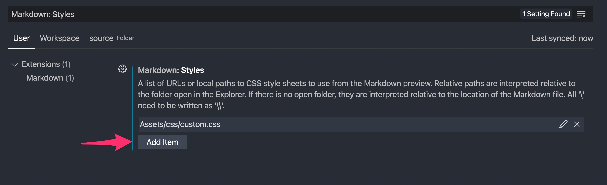

## Controlling IDs

Every element (pages, groups, maps, and encounters) in a module for EncounterPlus has an `id` value, including the module itself. The same is true for compendium elements (items, spells, and monsters). AND, the module itself allows an `id` value to be specified. This ID is how EncounterPlus knows whether, when imported, your element will overwrite an existing element or whether it will create a new element.

When you use module-packer to create an element, the ID for any given element is a function of the element's slug and the module's ID. This means that every time you recompile your module you can expect a given page to have the same ID as it has last time as long as neither the module ID nor the page's slug changed.

So, for most cases, you want to follow these rules about specifying IDs:
- **DO** specify a [randomly generated ID](https://www.uuidgenerator.net) for your module itself (i.e., **DO** set the ID value in module.yaml).
- Do **NOT** specify an ID for any page, group, map, encounter, item, spell, or monster that you create.

The only time you would really stray from these guidelines is if you are intentionally trying to replace the element from another module or the built-in compendium. However, to do this, you will need to know the ID of the existing item (which will involve extracting a module/compendium export and reading the XML to find out the ID).

## Attribute Targeting

Usually, when writing content in a markdown file, adding a special attribute to an element on the page is as simple as placing the attribute(s) in curly braces after the element (e.g., `{.red}` to make a table/monster/item/etc. red-colored.)

However, sometimes it becomes ambiguous as to which item is attempting to be attributed. Take, for example, the following blockquote:

```Markdown
> "What is that smell?! Oh. Oh no. No, no, no! Gods no!" - **Percy**
{.flavortext}
```

One might think that they are applying the `flavortext` attribute to the entire blockquote. However, because the blockquote's text ended with a bolded element, that attribute is actually being applied to the bold element.

Luckily, there is a way to address this. The module-packer and the VS Code extension utilize the [markdown-it-decorate extension](https://github.com/stereoplegic/markdown-it-decorate) to allow targeting a specific element. Essentially, this allows you to say "apply this style to the most-recent blockquote". To do that, we would change our attribute to look like the following:

```Markdown
> "What is that smell?! Oh. Oh no. No, no, no! Gods no!" - **Percy**
<!--{blockquote:.flavortext}-->
```

The [markdown-it-decorate extension](https://github.com/stereoplegic/markdown-it-decorate) also allows another powerful feature: inline CSS styles. If you're inclined to set an inline-CSS style, you can do so like the following:

```Markdown
<!--{container:.two-column style="height: 350px"}-->
```

This example would apply the `two-column` class to the preceding div and apply an inline-style of setting the height to 350 pixels.

## Manually Nesting Pages or Groups

Pages, Groups, Maps, and Encounters defined in the Module have their parent automatically defined by what folder they are placed in. However, this can be manually overridden on any page by specifying the `parent` property for that item.

In the case of a Page or Markdown file, this would be specified by setting the `parent` property in the YAML front-matter at the top of the Page. Example:
```yaml
---
name: Page name
parent: parent-slug
---
```

In the case of a Group, this would be specified by setting the `parent` property in the Group.YAML file created in the Group's folder:
```YAML
name: Example Group
parent: parent-slug
copy-files: true
```

Any entity can be the parent to another entity. For example, Pages can be parents to Maps, Maps can be parents to Encounter, etc. Care should be taken not to create a circular chain of relationships between parents and children, or the Module will be unable to be packed.

## Linking Pages

### Linking to a Page in the Same Module

Pages within a module can be linked to one-another by simply linking their slug. Example:

```Markdown
This is a [link to another page](another-page-slug).
```

### Linking to a Page in a Different Module

Pages in another module can be linked to by creating a link with both the module slug and the page slug. The format is `/module/{module-slug}/page/{another-page-slug}` where `{module-slug}` is the slug of the other module and `{another-page-slug}` is the slug of the page in that module. Example:

```Markdown
This is a [link to another page in another module](/module/another-module-slug/page/another-page-slug).
```

### Linking to a Header on the Same Page

A link to another section of the same page can be accomplished. A linkable anchor for each header on a page is automatically created when the module is built to either a `.module` file or a PDF. The name of the header is "slugified" when an anchor is being created. For example, the header "My Cool Header" would become "my-cool-header". To link within the same page, simply place a `#` symbol in front of the link destination. Example:

```Markdown
This is a [link to another section in the same page](#my-other-section).
```

## Roll Tables in EncounterPlus

A roll table is generally a table where the top left column header specifies one or more dice to be rolled, and the rest of the table contains a list of outcomes for the various rolls. Now that EncounterPlus has native support for roll tables, Module-Packer can automatically detect the presence of such tables and create the necessary data for EncounterPlus when exporting as a `.module` file. This functionality is still a bit experimental and is likely to be improved or expanded upon in the future.

The following is an example of a typical encounter roll table:
```Markdown
|[2d6](/roll/2d6)|Encounter|
|:---:|:---|
|2-3|3 Kobolds|
|4-5|2 Owlbears|
|6-8|10 Giant Rats|
|9-10|1 Vampire|
|11-12|1 Tarrasque|
```

To enable this functionality, simple add the following line to your `Module.yaml` file:
```YAML
create-roll-tables: true
```

There are currently two special types of roll tables that can be enabled with special attributes on the roll link. The first is "No Repeat" roll tables - where the rolls will automatically exclude any result that would repeat the row being used. The second is an "Each Row" roll table - where a roll will be executed for each row in the table. To use these features, add either the `{.no-repeat}` or `{.each-row}` attribute to the roll link. For example:

```Markdown
|[2d6](/roll/2d6){.no-repeat}|Encounter|
|:---:|:---|
|2-3|3 Kobolds|
|4-5|2 Owlbears|
|6-8|10 Giant Rats|
|9-10|1 Vampire|
|11-12|1 Tarrasque|
```

## Advanced Layouts

TODO

### Float Left/Right

TODO

### Wrap Text Around Images

TODO

### Multi-Column Content in Single-Column Pages

TODO


### Print-Only or Module-Only Items

Any element can be modified with the `.print-only` element to show up only in PDF output. Likewise, any element can be modified with the `.screen-only` attribute to only show up in EncounterPlus module output. Below is an example of having two images, one that only shows up in EncounterPlus, and a subsequent that only shows up in PDF output.

**Note**: When previewing in Visual Studio Code's live Markdown Preview window, items with `.print-only` will not appear (it treats the preview as if it were in EncounterPlus).

```Markdown
{.screen-only}
{.print-only}
```

### Automatically Update Compendium Links

When exporting to PDF, links to EncounterPlus's compendium entries will just appear as broken links in the PDF document. Often, a more useful thing to do is to have the PDF output link to D&D Beyond's item, spell, and monster entries when outputting to PDF. This can be done automatically with the `print-link-update` entry in your Module.yaml file:

The following will update compendium links to individual D&D Beyond Entries (e.g., a link to `/spell/fireball` in EncounterPlus will appear as `https://www.dndbeyond.com/spells/fireball` in PDF output).

```YAML
print-link-update: D&D Beyond Entries
```

The following will update compendium links to individual D&D Beyond Search Results (e.g., a link to `/spell/fireball` in EncounterPlus will appear as `https://www.dndbeyond.com/search?q=fireball` in PDF output).

```YAML
print-link-update: D&D Beyond Search
```

### Hiding Footer Text

TODO

### Full Page Cover Images

TODO

## Running from the Command Line

The Module Packer can be run from the command line. It will, however, require NodeJS and Python 3 to be installed on the local system.

1. Download the source code from this repository.
2. Navigate to the source code directory in your terminal.
2. Enter the following in your terminal where <Path to Module> is the root path of your module (i.e., the folder containing the Module.yaml file):
`python3 launcher.py run --path "<Path to Module>"`

If you want to output PDF, add `--output pdf` to your command:
`python3 launcher.py run --path "<Path to Module>" --output pdf`

## Splitting Monster Block Columns on Specific Properties

TODO

## Customizing Styles

If you have knowledge of how to work with Cascading Style Sheets, modifications can be made to the way Markdown is rendered by adding a `custom.css` file in the `assets/css` folder of your module. This `custom.css` will be evaluated AFTER the default stylesheet. If you want to completely override or replace the main stylesheet, it may be done by replacing the `global.css` file in the same `assets/css` folder. Do note, however, replacing the `global.css` will prevent updates to the default style sheet from taking effect and is generally not recommended for most use cases.

### Previewing Custom Styles in Visual Studio

To preview your custom style in Visual Studio Code, you must add your `custom.css` file to the list of VS Code's Markdown Preview stylesheets. Do so by going to Visual Studio Code's Settings, searching for "Markdown: Styles" and adding your `custom.css` file there. It is generally recommended that you set this Setting for the Workspace rather than for the User.

<p align="left">
  
</p>
