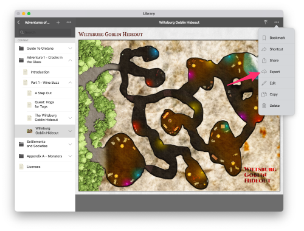
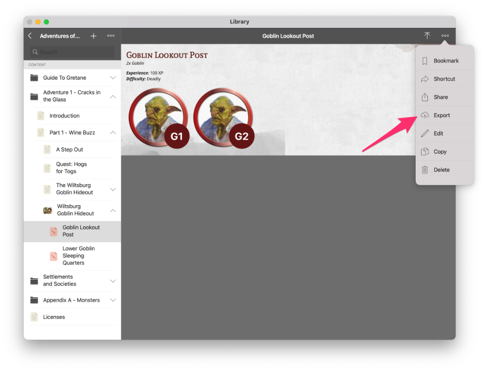

# Tutorial: Including Maps and Encounters

## Maps
1. Create your map in EncounterPlus as you normally would. It can be created in a temporary module or campaign.
2. View the Map in EncounterPlus's Library View.
3. Click the "..." icon and choose "Export". Save the zip file somewhere.

<p align="center">
  
</p>

4. In your Module's directory, create a subfolder for maps (I named mine "Maps").
5. Create an empty `.ignoregroup` file for this directory so the raw zip files are not included in your module.
6. Copy the map's zip file into this folder.
7. In your `Module.yaml` file, create a property named `maps`. Then, as a children maps, create individual elements for each map. Each element must contain a "path" property pointing to the map's `.zip` file. Optionally, each element can also specify a `parent`, and `order`, and a `slug` property. These specify the parent the map will be nested under, the order it will show up under its parent, and its slug link respectively.

Here is an example `Module.yaml` file with a couple of maps defined
```Markdown
name: My Module
slug: my-module
description: A campaign setting.
category: adventure
maps:
  - path: Maps/my-first-map.zip
    order: 2
    parent: my-adventure-part-1
    slug: my-first-map
  - path: Maps/my-second-map.zip
    order: 5
    parent: my-adventure-part-1
    slug: my-second-map
```

## Encounters
Encounters are added in a way very similar to maps.

1. Create your encounter in EncounterPlus as your normally would - this includes creating your Encounter as part of a loaded map so monsters are positioned correctly.
2. View the Encounter in EncounterPlus's Library View.
3. Click the "..." icon and choose "Export". Save the zip file somewhere.

<p align="center">
  
</p>

4. In your Module's directory, create a subfolder for maps (I named mine "Encounters").
5. Create an empty `.ignoregroup` file for this directory so the raw zip files are not included in your module.
6. Copy the encounter's zip file into this folder.
7. In your `Module.yaml` file, create a property named `encounters`. Then, as children of encounters, create individual elements for each encounter. Each element must contain a "path" property pointing to the encounter's `.zip` file. Optionally, each element can also specify a `parent`, and `order`, and a `slug` property. These specify the parent the encounter will be nested under, the order it will show up under its parent, and its slug link respectively.

Here is an example `Module.yaml` file with a couple of encounters defined after the maps. Note that you may nest encounters under maps as demonstrated.
```Markdown
name: My Module
slug: my-module
description: A campaign setting.
category: adventure
maps:
  - path: Maps/my-first-map.zip
    order: 2
    parent: my-adventure-part-1
    slug: my-first-map
  - path: Maps/my-second-map.zip
    order: 5
    parent: my-adventure-part-1
    slug: my-second-map
encounters:
  - path: Encounters/my-first-encounter.zip
    order: 1
    parent: my-first-map
    slug: my-first-encounter
  - path: Encounters/my-second-encounter.zip
    order: 2
    parent: my-first-map
    slug: my-second-encounter
```