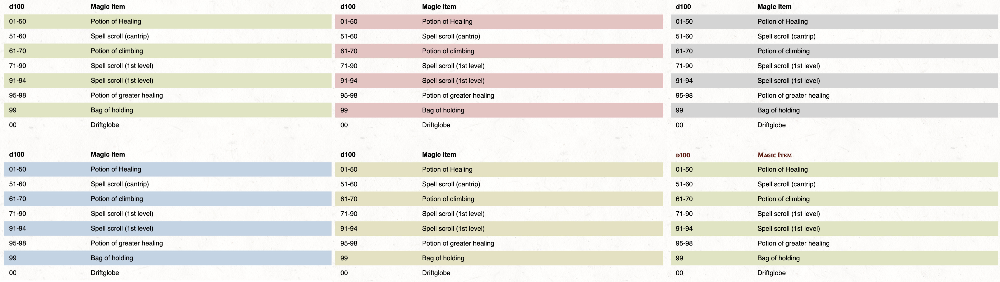

# Table of Contents


- [Introduction](#introduction)
- [Getting Started](#getting-started)
  - [Example Content](#example-content)
- [Managing Your Module Project](#managing-your-module-project)
  - [Module Folder Structure](#module-folder-structure)
  - [Module Properties](#module-properties-modulejson)
  - [Groups and Folders](#groups-and-folders)
  - [Markdown File Front-Matter](#markdown-file-front-matter)
- [Markdown Guide](#markdown-guide)
  - [Headings](#headings)
  - [Text Styles](#text-styles)
  - [Images](#images)
  - [Text Blocks & Block Quotes](#text-blocks--block-quotes)
  - [Links](#links)
  - [Tables](#tables)
  - [Page Breaks for Print](#page-breaks-for-print)
- [Visual Studio Code Extension](#visual-studio-code-extension)
- [Other Editors](#other-editors)
- [License](#license)

# Introduction

The EncounterPlus Module Packer is a simple standalone application for converting markdown documents into modules for [EncounterPlus](https://encounter.plus). It also allows exporting the markdown files into a PDF with a similar style. The Module Packer is also available as a [Visual Studio Code Extension](#visual-studio-code-extension).

<p align="center">
  
</p>

# Getting Started

It's easy to begin creating a module in markdown. A guide to Markdown syntax can be found further in this document in the [Markdown Guide](#markdown-guide) section.

1. Download the Module Packer for [macOS]((https://github.com/encounterplus/module-packer/releases/latest)), [Windows]((https://github.com/encounterplus/module-packer/releases/latest)), or as a [Visual Studio Code Plug-In](https://marketplace.visualstudio.com/items?itemName=JacobJohnston.encounterplus-markdown)!
2. Create a [folder](#Module-Structure) where you will write your module's text and images.
3. Start writing your module content in Markdown.
4. Pack your module so it can be imported by EncounterPlus.
5. Import your module into EncounterPlus!

## Example Content

The content of the [examples.zip](examples.zip) file can be used to see examples of multiple module structures or to test the application.

# Managing Your Module Project

## Module Folder Structure

Below is an example of how you might srtucture your Module content.

```
.
└── Assets               # Optional - allows override of the default style
└── Group A              # A group for the module.
    ├── Page A.md        # A page in Group A of the module.
    ├── Page A Cover.jpg # An image used in Page A.
    └── Page B.md        # A page in Group A of the module.
└── Group B              # A group for the module.
    ├── Page C.md        # A page in Group B of the module.
    └── Page D.md        # A page in Group B of the module.
└── Images               # A folder to store shared images.
    ├── .ignoregroup     # An empty file that instructs the Module Packer not to turn this into a Group
    ├── Image1.png       # An image used in multiple pages.
    └── Image2.jpg       # An image used in multiple pages.
├── module.json          # Optional - can define attributes of the module (e.g., Title, Author, Slug, etc.)
└── My Module.md         # A page at the root level of the module.
```

## Module Properties (module.json)

In the root folder of your module project, you can create a file named `module.json` to define properties about the module. If module.json does not exist, essential properties like `name` and `slug` will be inferred from the module's folder name. A more thorough guide to module.json is available.

```JSON
{
  "id": "<Random UUIDV4>",
  "name": "Example Module",
  "slug": "example-module",
  "description": "Example module description.",
  "category": "adventure",
  "author": "Dungeony MasterFace",
  "code": "ABC-123",
  "cover": "cover.jpg",
  "version": 4,
  "autoIncrementVersion": true
}
```

**Values:**
- `id`: If specified, will cause a module to be overwritten rather than duplicated when repeatedly imported. *Never* copy another module's UUID, or you will cause that module to be overwritten.
- `name`:

The `autoIncrementVersion` field will cause the version number to automatically increment each time the module is packed. This is useful for keeping track 

## Groups and Folders

Subdirectories under the main module folder will automatically be turned into Groups in the module. To have a folder *not* be made into a Group, create a file named `.ignoregroup` in the folder. That folder and all subfolders will no longer be turned into groups. They will, however, be included as a resource folder in the module (e.g. for the `images` folder).

## Markdown File Front-Matter

Each markdown document can contain front matter block for additional configuration.

```yaml
---
name: Page name
slug: page-name
pagebreak: h1,h2,h3
---
```

The front-matter fields are:
- `name` - An optional parameter that is the name of the page. If not specified, the file name will be used to name the page.
- `slug` - An optional parameter used for referencing pages (see links below). If not provided, it's automatically generated.
- `pagebreak` - An optional parameter which can be used for splitting single markdown document into multiple pages. The splitting is done automatically, based on the heading level array specified in this parameter and the actual content in the document. It's useful for describing map locations which can be added later as pins.

# Markdown Guide

Below you will find examples of markdown syntax with images as it will appear in Encounter Plus. While EncounterPlus supports nearly all of the traditional markdown tags, it also supports many non-standard tags as well.

## Headings

A single hash symbol denotes a first-level heading, two hash symbols is a second-level heading, three hash symbols is third-level, etc. Note that text content that occurs immediately after a first level heading will have a fancy first letter. 

```Markdown
# My Heading 1 
```
<p align="left">
  
</p>

```Markdown
## My Heading 2
```
<p align="left">
  
</p>

```Markdown
### My Heading 3
```
<p align="left">
  
</p>

```Markdown
#### My Heading 4
```
<p align="left">
  
</p>

```Markdown
##### My Heading 5
```
<p align="left">
  
</p>

```Markdown
###### My Heading 6
```
<p align="left">
  
</p>

## Text Styles

Below is an example of standard text format styles in markup:

```Markdown
This is an example of *italics*. 

This is an example of **bold**.

This is an example of _underline_.

This is an example of ==mark==.

This is an example of ~subscript~

This is an example of ^superscript^

This is an example of ~~strikethrough~~.
```

And their corresponding appearance:
<p align="left">
  
</p>

## Images

An image is shown by using an exclamation point, followed by a description in brackets, followed by a link to the image file in parantheses.

```Markdown

```
<p align="left">
  
</p>

By default, in markdown, an image will take the full width of the page, minus any default margins. An image can be more manually sized by adding a space, and equals sign, and dimensions after the image.

```Markdown

```
<p align="left">
  
</p>

If you are only interested in specifying the width, and allowing the image to size its height by the innate aspect ratio, simply forego specifying the height.

```Markdown

```

Finally, a special cover image style may be placed above the top header. This is specified by adding the text `{.size-cover}` after the image.

```Markdown
{.size-cover}

## Heading 2
```
<p align="left">
  
</p>

## Text Blocks & Block Quotes

You can add default text block with standard block quote syntax:

```Markdown
> Text block
```
<p align="left">
  
</p>

`Read Aloud` text by adding custom class `read` to standard block quote:

```Markdown
> Read aloud text
{.read}
```
<p align="left">
  
</p>

## Links

Normally, in markdown, links would be used to link to other webpages. However, in EncounterPlus, you can add links to any monster, player, item and spell in the compendium or to other pages or maps.

```Markdown
[Goblin](/monster/goblin)
[Staff of Power](/item/staff-of-power)
[Fireball](/spell/fireball)
[Example page](example-page)
```

## Tables

The Module Packer and Visual Studio Code extension support the standard Markdown table format. In addition, the MultiMarkdown table formatters are also supported for advanced table constructs like cell spans and column spans.

```Markdown
|   d100   | Magic Item                |
|----------|---------------------------|
| 01-50    | Potion of Healing         |
| 51-60    | Spell scroll (cantrip)    |
| 61-70    | Potion of climbing        |
| 71-90    | Spell scroll (1st level)  |
| 91-94    | Spell scroll (1st level)  |
| 95-98    | Potion of greater healing |
| 99       | Bag of holding            |
| 00       | Driftglobe                |
```

In addition, table colors can be customized with by adding the `{.green}`, `{.red}`, `{.blue}`, `{.yellow}`, `{.gray}`. Additionally, the `{.headerTitle}` style can be added to change the header text appearance.

```Markdown
|   d100   | Magic Item                |
|----------|---------------------------|
| 01-50    | Potion of Healing         |
| 51-60    | Spell scroll (cantrip)    |
| 61-70    | Potion of climbing        |
| 71-90    | Spell scroll (1st level)  |
| 91-94    | Spell scroll (1st level)  |
| 95-98    | Potion of greater healing |
| 99       | Bag of holding            |
| 00       | Driftglobe                |
{.blue .headerTitle}
```
<p align="left">
  
</p>

A special, right-floating stat block style table can be applied by using the `{.statblock}` attribute

```Markdown
|  My Hero                         ||
|----------|------------------------|
|                 ||
| Value A  | Characteristic A       |
| Value B  | Characteristic B       |
| Value C  | Characteristic C       |
| Value D  | Characteristic D       |
| Value E  | Characteristic E       |
| Value F  | Characteristic F       |
{.statblock}
```
<p align="left">
  
</p>

## Page Breaks for Print

When designing content for print, content will be clipped at a single page unless you manually specify a page break with the `(page)` tag in your markdown. The `(page)` tag will be hidden in the preview and in EncounterPlus.

```Markdown
This is some text.

(page)

This is some more text.
```

# Visual Studio Code Extension
<p align="center">
  
</p>

Visual Studio Code has great support for rendering markdown with custom styles out-of-the-box. However, with the help of the official [EncounterPlus Markdown Extension](https://marketplace.visualstudio.com/items?itemName=JacobJohnston.encounterplus-markdown), Visual Studio Code can preview markdown pages as if they were already run through the Module Packer and rendered in EncounterPlus. Simply install the plugin and preview your markdown documents.

The EncounterPlus Markdown Extension also provides access to the same module packing and PDF export capabilities as the standalone Module Packer.

## Using the EncounterPlus Markdown Extension

1. Open Visual Studio Code.
2. Open the Extensions View and search for "EncounterPlus Markdown" in the marketplace.
3. Install the EncounterPlus Markdown extension.
4. In Visual Studio Code, open the folder that will contain your module.
5. Open the EncounterPlus Module View (shown above).
6. If necessary, create a module.json file for your project.
7. Use the standard Visual Studio Code file view to create markdown files.
8. Use the standard Visual Studio Code preview to preview markdown (they will now be styled as if they were in EncounterPlus).
9. Use the EncounterPlus Module View to build and export your module!

# Other Editors

### Ulysses
User Team-Hufflepuff has created a wonderful style for Ulysses that allows previewing markdown authored in Ulysses as it would show in EncounterPlus. Ulyssess does not currently support HTML or the extended attributes. Download the [EncounterPlus Ulysses plugin here](documentation/EncounterPlus.ulstyle).

<p align="center">
  
</p>

#### More Editors
Have you supported EncounterPlus's style in another editor? Let us know on [Discord](https://discord.gg/rc8Bez8)!

# License

[CC0 1.0 (Public Domain)](LICENSE.md)
