# Table of Contents


- [Introduction](#introduction)
- [Getting Started](#getting-started)
  - [Example Content](#example-content)
- [Managing Your Module Project](#managing-your-module-project)
  - [Module Folder Structure](#module-folder-structure)
  - [Module Properties](#module-properties-modulejson)
  - [Groups and Folders](#groups-and-folders)
  - [Markdown File Front-Matter](#markdown-file-front-matter)
- [Markdown Guide](#markdown-guide)
  - [Headings](#headings)
  - [Text Styles](#text-styles)
  - [Images](#images)
  - [Text Blocks & Block Quotes](#text-blocks--block-quotes)
  - [Links](#links)
  - [Tables](#tables)
  - [Monsters](#monsters)
  - [Page Breaks for Print](#page-breaks-for-print)
- [Visual Studio Code Extension](#visual-studio-code-extension)
- [Other Editors](#other-editors)
- [License](#license)

# Introduction

The EncounterPlus Module Packer is a simple standalone application for converting markdown documents into modules for [EncounterPlus](https://encounter.plus). It also allows exporting the markdown files into a PDF with a similar style. The Module Packer is also available as a [Visual Studio Code Extension](#visual-studio-code-extension).

<p align="center">
  
</p>

# Getting Started

It's easy to begin creating a module in markdown. A guide to Markdown syntax can be found further in this document in the [Markdown Guide](#markdown-guide) section.

1. Download the Module Packer for [macOS]((https://github.com/encounterplus/module-packer/releases/latest)), [Windows]((https://github.com/encounterplus/module-packer/releases/latest)), or as a [Visual Studio Code Plug-In](https://marketplace.visualstudio.com/items?itemName=JacobJohnston.encounterplus-markdown)!
2. Create a [folder](#Module-Structure) where you will write your module's text and images.
3. Start writing your module content in Markdown.
4. Pack your module so it can be imported by EncounterPlus.
5. Import your module into EncounterPlus!

## Example Content

The content of the [examples.zip](examples.zip) file can be used to see examples of multiple module structures or to test the application.

# Managing Your Module Project

## Module Folder Structure

Below is an example of how you might structure your Module content.

```
.
└── Assets               # Optional - allows override of the default style
└── Encounters           # The folder for maps
    ├── .ignoregroup     # An empty file that instructs the Module Packer not to turn this into a Group
    └── Encounter.zip    # The encounter zip file exported from EncounterPlus
└── Group A              # A group for the module.
    ├── Page A.md        # A page in Group A of the module.
    ├── Page A Cover.jpg # An image used in Page A.
    ├── Page B.md        # A page in Group A of the module.
    └── Group.yaml       # Optional - can define attributes of the group (e.g., Name, Order, etc.)
└── Group B              # A group for the module.
    ├── Page C.md        # A page in Group B of the module.
    └── Page D.md        # A page in Group B of the module.
└── Images               # A folder to store shared images.
    ├── .ignoregroup     # An empty file that instructs the Module Packer not to turn this into a Group
    ├── Image1.png       # An image used in multiple pages.
    └── Image2.jpg       # An image used in multiple pages.
└── Maps                 # The folder for maps
    ├── .ignoregroup     # An empty file that instructs the Module Packer not to turn this into a Group
    └── Map1.zip         # The map zip file exported from EncounterPlus
├── Module.yaml          # Optional - can define attributes of the module (e.g., Title, Author, Slug, etc.)
└── My Module.md         # A page at the root level of the module.
```

## Module Properties (module.yaml)

In the root folder of your module project, you can create a file named `Module.yaml` to define properties about the module. If `Module.yaml` does not exist, essential properties like `name` and `slug` will be inferred from the module's folder name. A more thorough guide to `Module.yaml` is available.

```YAML
id: <Random UUIDV4>
name: Example Module
slug: example-module
description: Example module description.
category: adventure
author: Dungeony MasterFace
code: ABC-123
cover: cover.jpg
version: 4
autoIncrementVersion: true
compressImages: false
maps:
  - path: Maps/my-first-map.zip
    order: 2
    parent: my-adventure-part-1
    slug: my-first-map
encounters:
  - path: Encounters/my-first-encounter.zip
    order: 1
    parent: my-first-map
    slug: my-first-encounter
```

**Values:**
All `Module.yaml` values are optional - and default values will be used for anything not specified.
- `id`: If specified, will cause a module to be overwritten rather than duplicated when repeatedly imported. *Never* copy another module's UUID, or you will cause that module to be overwritten.
- `name`: The name of the module.
- `slug`: The slug for the module. Slugs should follow standard URL slug guidelines (best to stick with only lowercase letters and dashes). If a slug is manually specified, care should be taken that the slug is not repeated elsewhere in the module. Repeats will cause prevent the module from being created.
- `description`: The description of the module.
- `category`: The category of the module. May be `adventure` or `other`.
- `author`: The author of the module.
- `code`: A reference code for the module.
- `cover`: The file name of the cover image for the module (placed in the same directory).
- `version`: The version of the module. Must be an integer.
- `compressImages`: If true, the images will be automatically compressed to make the module smaller in file size.
- `autoIncrementVersion`: May be `true` or `false`. If `true`, it will cause the version number to automatically increment each time the module is packed. This is useful for keeping track 
- `maps`: The maps to include with the module. See more in the [Including Maps & Encounters Tutorial](MapsAndEncounters.md).
- `encounters`: The encounters to include with the module. See more in the [Including Maps & Encounters Tutorial](MapsAndEncounters.md).

## Groups and Folders

Subdirectories under the main module folder will automatically be turned into Groups in the module. To have a folder *not* be made into a Group, create a file named `.ignoregroup` in the folder. That folder and all subfolders will no longer be turned into groups. They will, however, be included as a resource folder in the module (e.g. for the `images` folder).

Groups can have some properties defined by creating a `Group.yaml` file in the group's folder on the file system. 

```YAML
name: Example Group
slug: example-grup
order: 5
```

All `Group.yaml` values are optional - and default values will be used for anything not specified. 
- `name`: The name of the group.
- `slug`: The slug for the group. Slugs should follow standard URL slug guidelines (best to stick with only lowercase letters and dashes). If a slug is manually specified, care should be taken that the slug is not repeated elsewhere in the module. Repeats will cause prevent the module from being created.
- `order`: An order for the group. Lower numbers will be placed before higher numbers. If two groups share the same order value, their effective order may differ upon each import. Pages and groups placed at the same place in the tree will respect each other's group values.


## Markdown File Front-Matter

Each markdown document can contain front matter block for additional configuration.

```yaml
---
name: Page name
slug: page-name
order: 3
module-pagebreaks: h1, h2, h3
pdf-pagebreaks: h1
footer: My Custom Footer Text
hide-footer-text: false
---
```

**Values:**
All front-matter values are optional - and default values will be used for anything not specified.
- `name`: The name of the page.
- `slug`: The slug for the module. Slugs should follow standard URL slug guidelines (best to stick with only lowercase letters and dashes). If a slug is manually specified, care should be taken that the slug is not repeated elsewhere in the module. Repeats will cause prevent the module from being created.
- `order`: An order for the page. Lower numbers will be placed before higher numbers. If two pages share the same order value, their effective order may differ upon each import. Pages and groups placed at the same place in the tree will respect each other's group values.
- `module-pagebreak`: Element tags that, when specified, will automatically result in the markdown being split into individual pages. The order specified here will cause pages to nest accordingly (e.g., H2 values will be nested under H1 values). This will only apply when the markdown is being output to an EncounterPlus module.
- `pdf-pagebreak`: Element tags that, when specified, will automatically result in the markdown output being split into individual pages. The order specified here will cause pages to nest accordingly (e.g., H2 values will be nested under H1 values). This will only apply when the markdown is being output to a PDF.
- `footer`: If specified, allows custom footer text to be entered. Otherwise the footer text follows the format of `Page Name | Parent Name`.
- `hide-footer-text`: If true, will hide footer text entirely.

# Markdown Guide

Below you will find examples of markdown syntax with images as it will appear in Encounter Plus. While EncounterPlus supports nearly all of the traditional markdown tags, it also supports many non-standard tags as well.

## Headings

A single hash symbol denotes a first-level heading, two hash symbols is a second-level heading, three hash symbols is third-level, etc. Note that text content that occurs immediately after a first level heading will have a fancy first letter. 

```Markdown
# My Heading 1 
```
<p align="left">
  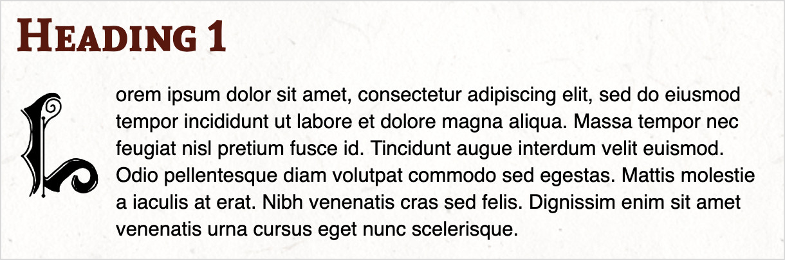
</p>

```Markdown
## My Heading 2
```
<p align="left">
  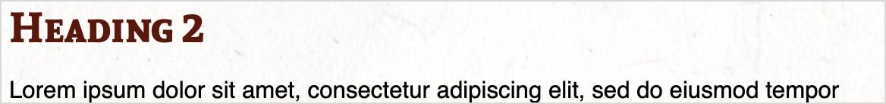
</p>

```Markdown
### My Heading 3
```
<p align="left">
  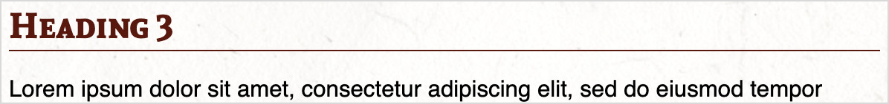
</p>

```Markdown
#### My Heading 4
```
<p align="left">
  
</p>

```Markdown
##### My Heading 5
```
<p align="left">
  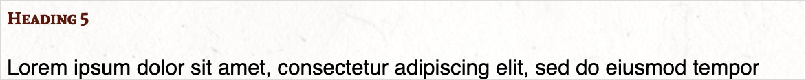
</p>

```Markdown
###### My Heading 6
```
<p align="left">
  
</p>

## Text Styles

Below is an example of standard text format styles in markup:

```Markdown
This is an example of *italics*. 

This is an example of **bold**.

This is an example of _underline_.

This is an example of ==mark==.

This is an example of ~subscript~

This is an example of ^superscript^

This is an example of ~~strikethrough~~.
```

And their corresponding appearance:
<p align="left">
  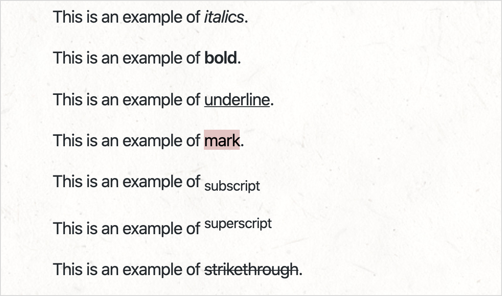
</p>

## Images

An image is shown by using an exclamation point, followed by a description in brackets, followed by a link to the image file in parantheses.

```Markdown

```
<p align="left">
  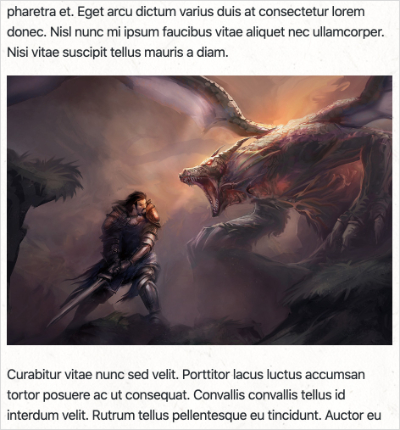
</p>

### Image Sizes

By default, in markdown, an image will take the full width of the page, minus any default margins. An image can be more manually sized by adding a space, and equals sign, and dimensions after the image.

```Markdown

```
<p align="left">
  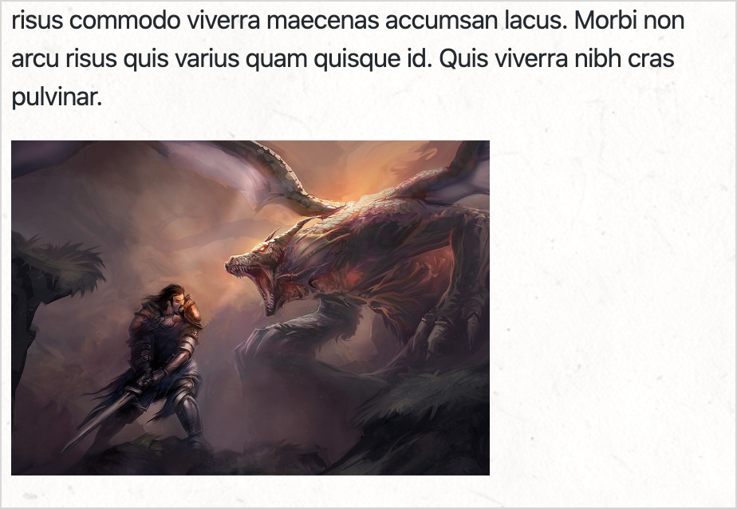
</p>

If you are only interested in specifying the width, and allowing the image to size its height by the innate aspect ratio, simply forego specifying the height.

```Markdown

```

A special cover image style may be placed above the top header. This is specified by adding the text `{.size-cover}` after the image.

```Markdown
{.size-cover}

## Heading 2
```
<p align="left">
  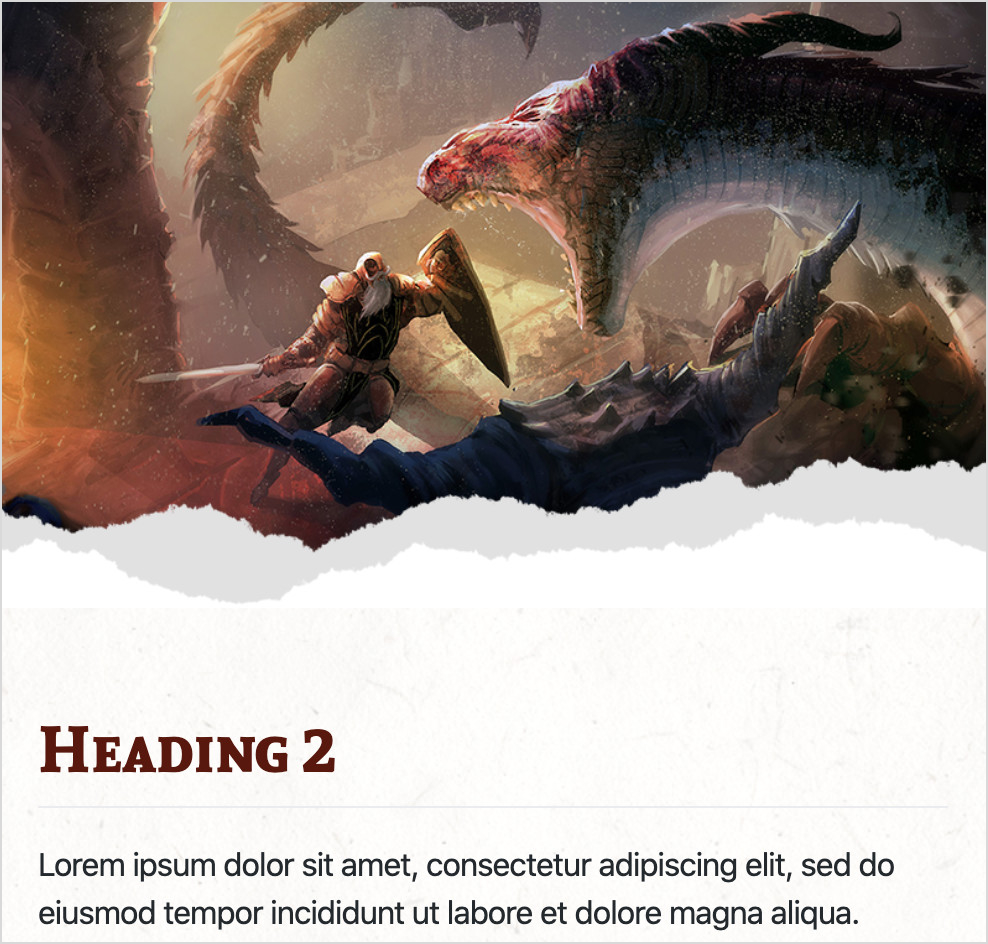
</p>

### Floating Images

Images can be set to float on the left or right side of the view by using the `{.float-left}` and `{.float-right}` styles.

```Markdown
{.float-left}
```

<p align="left">
  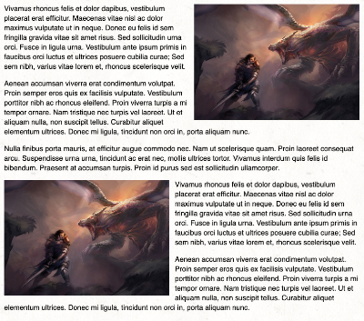
</p>

## Text Blocks & Block Quotes

You can add default text block with standard block quote syntax:

```Markdown
> Text block
```
<p align="left">
  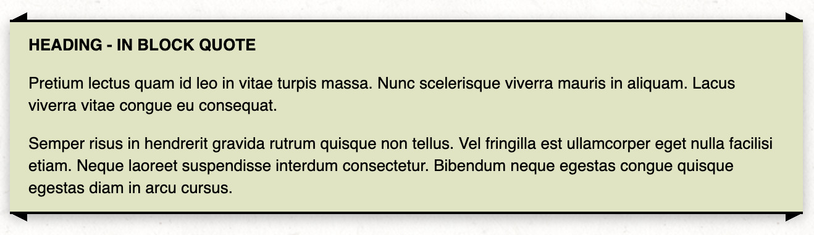
</p>

A Read-aloud text style can be shown by adding custom class `read` to standard block quote:

```Markdown
> Read aloud text
{.read}
```
<p align="left">
  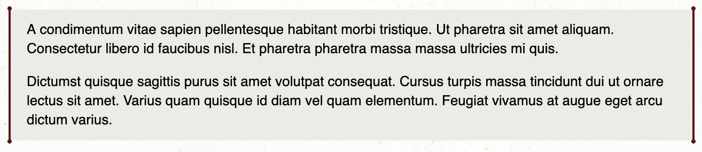
</p>

A paper/parchment text block style can be shown by adding custom class `paper` to standard block quotes:

```Markdown
> Text in paper
{.paper}
```
<p align="left">
  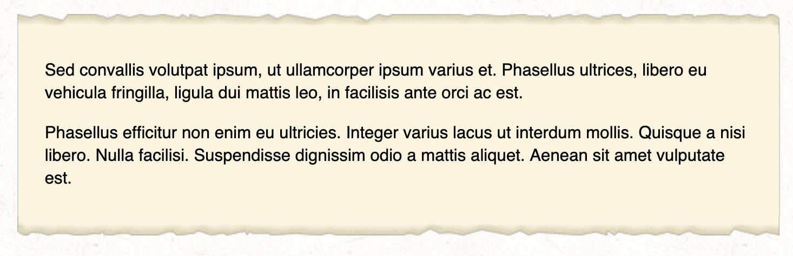
</p>

A flavor-text text block style can be shown by adding custom class `flavortext` to standard block quotes:

```Markdown
> Flavor text
{.flavortext}
```
<p align="left">
  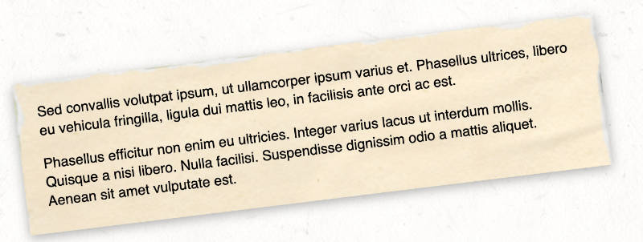
</p>

A flowchart text block style can be shown by adding custom class `flowchart` and `flowchart-with-link` to standard block quotes:

```Markdown
> **Chapter 1** {.text-center}
>
> Text goes here. {.flowchart}

> **Chapter 2** {.text-center}
>
> Text goes here. {.flowchart-with-link}
```
<p align="left">
  
</p>

## Links

Normally, in markdown, links would be used to link to other webpages. However, in EncounterPlus, you can add links to any monster, player, item and spell in the compendium or to other pages or maps. Always link to the item's slug. Slugs are absolute and do not need paths or groups specified when linking. Monster links should be prefaced with `/monster/`. Item links should be prefaced with `/item/`. Spell links should be prefaced with `/spell/`. 

```Markdown
[Example page](example-page)
[Goblin](/monster/goblin)
[Staff of Power](/item/staff-of-power)
[Fireball](/spell/fireball)
```

## Tables

The Module Packer and Visual Studio Code extension support the standard Markdown table format. In addition, the MultiMarkdown table formatters are also supported for advanced table constructs like cell spans and column spans.

```Markdown
|   d100   | Magic Item                |
|----------|---------------------------|
| 01-50    | Potion of Healing         |
| 51-60    | Spell scroll (cantrip)    |
| 61-70    | Potion of climbing        |
| 71-90    | Spell scroll (1st level)  |
| 91-94    | Spell scroll (1st level)  |
| 95-98    | Potion of greater healing |
| 99       | Bag of holding            |
| 00       | Driftglobe                |
```

In addition, table colors can be customized with by adding the `{.green}`, `{.red}`, `{.blue}`, `{.yellow}`, `{.gray}`, and `{.neutral}`. Additionally, the `{.headerTitle}` style can be added to change the header text appearance.

```Markdown
|   d100   | Magic Item                |
|----------|---------------------------|
| 01-50    | Potion of Healing         |
| 51-60    | Spell scroll (cantrip)    |
| 61-70    | Potion of climbing        |
| 71-90    | Spell scroll (1st level)  |
| 91-94    | Spell scroll (1st level)  |
| 95-98    | Potion of greater healing |
| 99       | Bag of holding            |
| 00       | Driftglobe                |
{.blue .headerTitle}
```
<p align="left">
  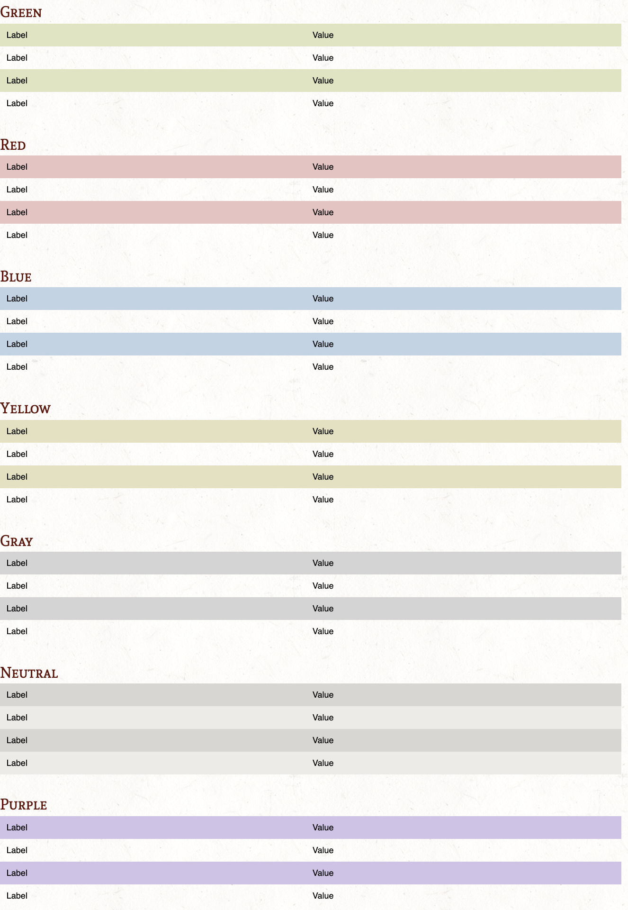
</p>

A special, right-floating sidebar style table can be applied by using the `{.sidebar}` attribute.

```Markdown
|  My Hero                         ||
|----------|------------------------|
|                 ||
| Value A  | Characteristic A       |
| Value B  | Characteristic B       |
| Value C  | Characteristic C       |
| Value D  | Characteristic D       |
| Value E  | Characteristic E       |
| Value F  | Characteristic F       |
{.sidebar}
```
<p align="left">
  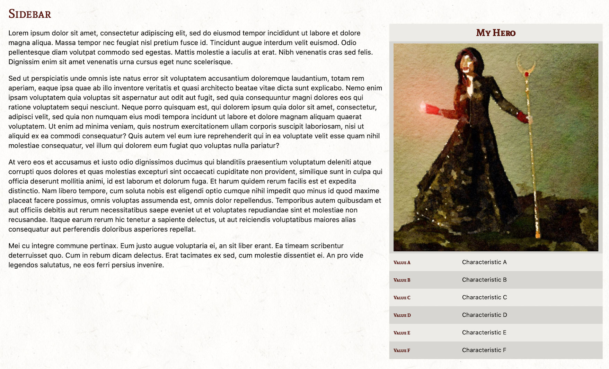
</p>

A shop table style also exists with special header values for showing categories and subcategories of shop items. Mark the table with the `{.shop}` attrobite and use the `{.shopH1}` and `{.shopH2}` row styles for category headers.

```Markdown
|||
|-------|-------|
| Category      |{.shopH1}
| Subcategory   |{.shopH2}
| Item  | ## gp |
| Item  | ## gp |
| Subcategory   |{.shopH2}
| Item  | ## gp |
| Item  | ## gp |
{.shop}
```

<p align="left">
  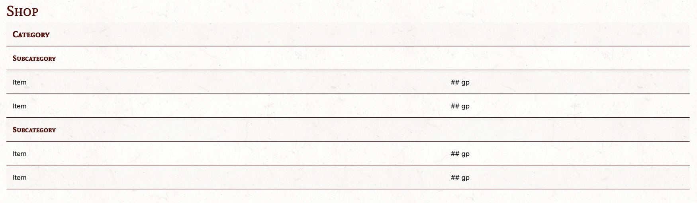
</p>

## Monsters

Monster stat blocks can be created within a Markdown file. When exported as a module, these monsters will be added to EncounterPlus's compendium. The Monster stat blocks are specified using standard [YAML](https://en.wikipedia.org/wiki/YAML) just like the Front-Matter on each page.

~~~Markdown
```Monster {.two-column}
id: 2c011c22-0f0c-4cc8-95de-9f53a9b89df5
name: Evil McEvilface
slug: evil-mcevilface
size: Medium
type: humanoid
alignment: neutral evil
ac: 15
hp: 30 (10d6)
speed: 30 ft.
str: 17
dex: 13
con: 12
int: 10
wis: 6
cha: 8
saves: Str + 2
skills: Stealth +6
vulnerabilities: radiant
resistances: bludgeoning, piercing
damageImmunities: poison
conditionImmunities: poisoned, petrified
senses: darkvision 60 ft., passive Perception 9
languages: Common, Celestial
challenge: 1/4
environments: forest, grassland, hill, underdark
image: Monster.jpg
token: MonsterToken.png
traits:
  - name: Smells Bad
    description: The Evil McEvilface smells pretty ripe. This doesn't do anything to the party, but makes unarmed combat and grappling far less pleasant.
actions:
  - name: Novelty-Sized Plunger
    description: "Melee Weapon Attack: +5 to hit, reach 5 ft., one target. Hit: 7 (1d6 + 4) suction damage."  
  - name: Open-carry Trebuchet
    description: "Ranged Weapon Attack: +5 to hit, range 80/320 ft., one target. Hit: 7 (1d6 + 4) bludgeon damage."
reactions:
  - name: Indignant Glare
    description: If the Evil McEvilface makes a successful spell saving throw, the Evil McEvilface glares at you disapprovingly and you feel shame. Your next ability check must be rolled with disadvantage.
legendaryActions:
  - description: The Evil McEvilface can take 1 legendary actions, using the Explosion option below.
  - name: Explosion
    description: "The Evil McEvilface suddenly explodes doing 1d20 damage to all creatures within 10 ft. This kills the Evil McEvilface."    
```
~~~

<p align="left">
  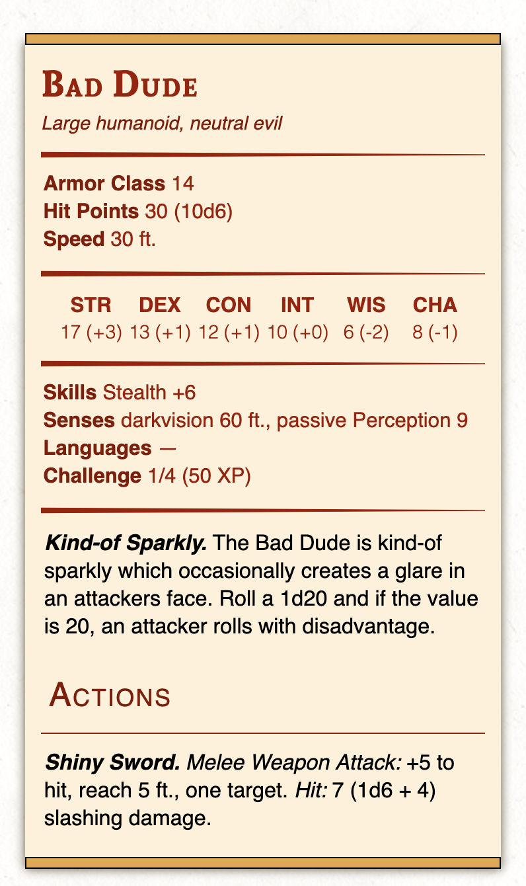
</p>

There are two styles of stat blocks available: a standard single-column stat block (default) and a two-column stat block (specified with the `.two-column` attribute as shown above).

<p align="left">
  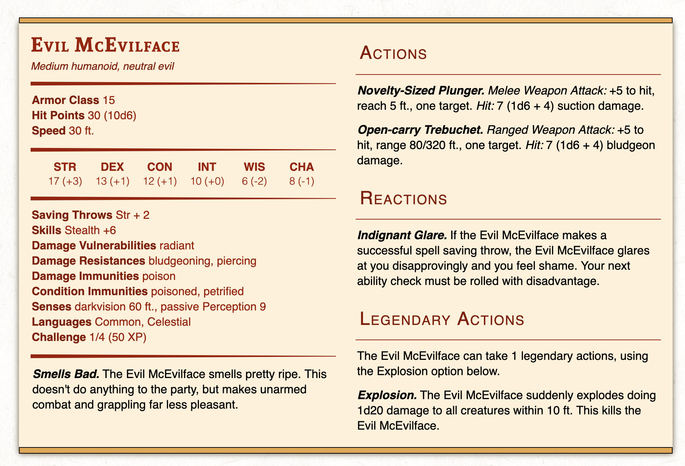
</p>

Like images, monster stat blocks may be used with the standard `.float-left` and `.float-right` style attributes.

Monster stat blocks can be rendered in a variety of colors with the `.blue`, `.green`, `.red`, `.yellow`, `.gray`, and `.neutral` tags.

<p align="left">
  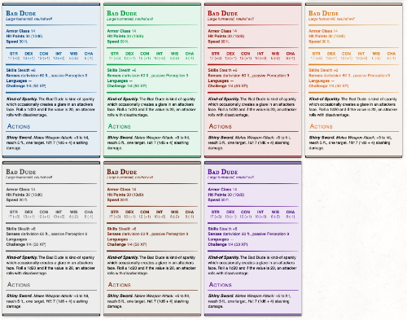
</p>

## Special Tags for Print/PDF

### Page Breaks

When designing content for print, content will be clipped at a single page unless you manually specify a page break with the `(print-page)` tag in your markdown. The `(print-page)` tag will be hidden in the preview and in EncounterPlus.

```Markdown
This is some text.

(print-page)

This is some more text.
```

### Column Breaks

If on the first column and you want to break to the next column, you can use the `(print-column)` tag. 

```Markdown
This is some text.

(print-column)

This is some more text.
```

### PDF-Only Content

For elements that you want to show *only* in the print version, you can use the `{.print-only}` attribute.
```Markdown
{.print-only}
```

### EncounterPlus-Only Content

Likewise, for elements that you to show *only* in EncounterPlus, you can use the `{.screen-only}` attribute.
```Markdown
{.screen-only}
```

# Visual Studio Code Extension
<p align="center">
  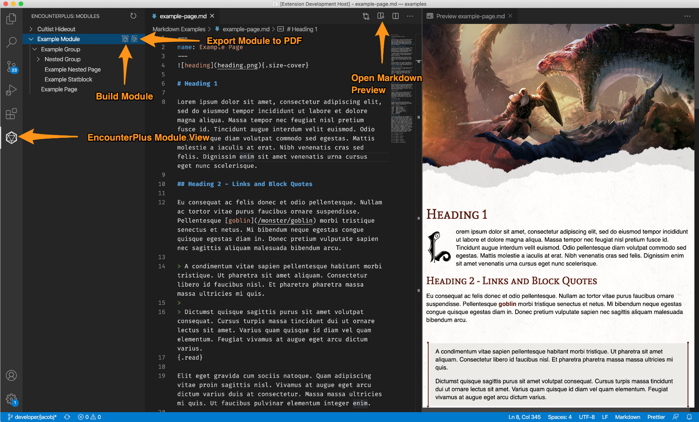
</p>

Visual Studio Code has great support for rendering markdown with custom styles out-of-the-box. However, with the help of the official [EncounterPlus Markdown Extension](https://marketplace.visualstudio.com/items?itemName=JacobJohnston.encounterplus-markdown), Visual Studio Code can preview markdown pages as if they were already run through the Module Packer and rendered in EncounterPlus. Simply install the plugin and preview your markdown documents.

The EncounterPlus Markdown Extension also provides access to the same module packing and PDF export capabilities as the standalone Module Packer.

## Using the EncounterPlus Markdown Extension

1. Open Visual Studio Code.
2. Open the Extensions View and search for "EncounterPlus Markdown" in the marketplace.
3. Install the EncounterPlus Markdown extension.
4. In Visual Studio Code, open the folder that will contain your module.
5. Open the EncounterPlus Module View (shown above).
6. If necessary, create a `Module.yaml` file for your project.
7. Use the standard Visual Studio Code file view to create markdown files..
8. Use the standard Visual Studio Code preview to preview markdown (they will now be styled as if they were in EncounterPlus).
9. Use the EncounterPlus Module View to build and export your module!

# Other Editors

### Ulysses
User Team-Hufflepuff has created a wonderful style for Ulysses that allows previewing markdown authored in Ulysses as it would show in EncounterPlus. Ulyssess does not currently support HTML or the extended attributes. Download the [EncounterPlus Ulysses plugin here](documentation/EncounterPlus.ulstyle).

<p align="center">
  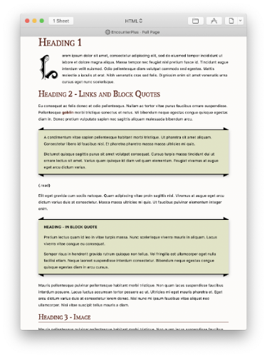
</p>

#### More Editors
Have you supported EncounterPlus's style in another editor? Let us know on [Discord](https://discord.gg/rc8Bez8)!

# License

[CC0 1.0 (Public Domain)](LICENSE.md)
